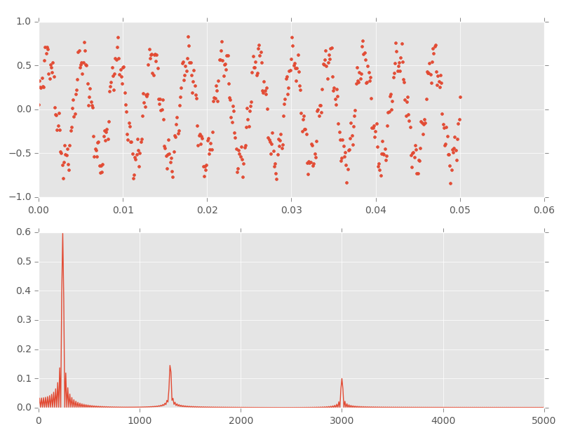
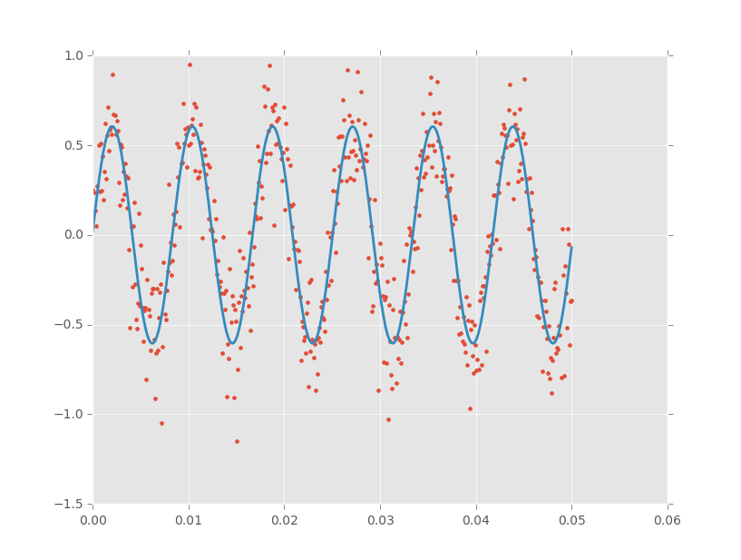

## Welcome

Seismo is new. Seismo is for finding and extracting signals in really long
lightcurves, so it needs to be able to go really fast too, and that means that
it needs to be able to advantage of multiple cores or GPUs in your computer.

At the moment Seismo can only do Deeming Periodograms but this will change
quickly.

## Current features

* Parallel Deeming periodogram routines (CPU/GPU)
* Simultaneous fitting of multiple sine waves
* Network access. Call seismo routines on a remote server (Python 2.7 only at the moment)

## Installation

Make sure you have `python 2.7` or newer as well as `pip`

On OSX I use [homebrew](http://brew.sh/). If you have not, install `python`
from there first then install pip.

    (optional) brew install python
    brew install pip

On Debian/Ubuntu

    sudo apt-get install python-pip

Get `seismo` with

    git clone git@github.com:ezietsman/seismo.git

Once pip is installed, install `seismo` by running the following in the seismo folder.

    pip install numpy flask-restful mako pyopencl matplotlib scipy requests
    pip install .

You may need `sudo` for these commands in linux

Please let me know if it doesn't work for you.

## Examples

### Finding peaks in time-series data


import matplotlib
from matplotlib.pyplot import subplot, plot, show
from numpy import linspace, sin, pi
import seismo

matplotlib.style.use('ggplot')

# create fake data
x = linspace(0, 0.05, 500)
y = 0.6*sin(2*pi*240*x)\
    + 0.15*sin(2*pi*1303*x + 0.4)\
    + 0.1*sin(2*pi*3000*x)

# Calculate Deeming periodogram 
f, a = seismo.deeming(x, y)

# plot
subplot(211)
plot(x, y, '.')
subplot(212)
plot(f, a)

show()


### Fitting a sinewave to noisy data


import matplotlib
from matplotlib.pyplot import subplot, plot, show
from numpy import linspace, sin, pi, random
import seismo

matplotlib.style.use('ggplot')

# create fake data
x = linspace(0, 0.05, 500)
y = 0.6*sin(2*pi*120*x) + 0.2*random.randn(x.size)

# find peak using periodogram
f, a = seismo.deeming(x, y)
fmax, amax = seismo.find_peak(f, a)

# create and fit signal
signal = seismo.signal()
comp1 = seismo.sinewave(amax, fmax, 0)
signal.add_component(comp1)
signal.fit(x, y)

# plot
plot(x, y, '.')
plot(x, signal.evaluate(x), lw=2)
show()


See the `examples` folder for more detailed examples. I'm sorry, I haven't written proper docs yet. Coming Soon!

## Running the unit tests

To see if the installation completed successfully, run:

    py.test tests

This should give some output and all the tests should pass.

## Notes about OpenCL and GPU calculations

To use the [OpenCL](https://www.khronos.org/opencl/) extensions, you need an
OpenCL driver installed for each different device. On OSX this is installed
already, on Linux it is not. For NVIDIA users, one is installed with the CUDA
SDK, I do not know what is needed for AMD cards and CPUs.

**NOTE:** You do NOT need the CUDA SDK for the opencl driver.

